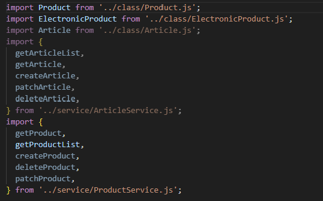

## 미션 목표

Jest와 Supertest를 사용해 유닛 테스트, 통합 테스트 작성하기

## 요구사항

### 기본

- [ ] Jest의 테스트 커버리지 도구를 사용하도록 설정해 주세요.
- [ ] 인증이 필요하지 않은 상품 API에 대한 통합 테스트를 작성해 주세요.
- [ ] 인증이 필요하지 않은 게시글 API에 대한 통합 테스트를 작성해 주세요.
- [ ] 로그인, 회원가입 API에 대한 통합 테스트를 작성해 주세요.
- [ ] 인증이 필요한 상품 API에 대해 통합 테스트를 작성해 주세요.
- [ ] 인증이 필요한 게시글 API에 대해 통합 테스트를 작성해 주세요.

### 심화

- [ ] 상품 API의 비즈니스 로직에 대해 Mock, Spy를 활용해 유닛 테스트를 작성해 주세요.

## 주요 변경사항

-

## 스크린샷

## 멘토에게

- 셀프 코드 리뷰를 통해 질문 이어가겠습니다.
